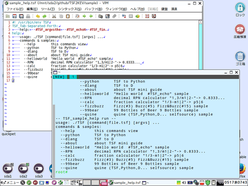

# プログラミング言語「TSF_Tab-Separated-Forth」開発中。

目標は「[LTsv10kanedit](https://github.com/ooblog/LTsv10kanedit "ooblog/LTsv10kanedit: 「L:Tsv」の読み書きを中心としたモジュール群と漢字入力「kanedit」のPythonによる実装です(準備中)。")」の「[LTsv/kanedit.vim](LTsv/kanedit.vim "LTsv/kanedit.vim")」などをVim使わずに「TSF」だけで動かす事。実装はとりあえずPythonとD言語で。  
TSFはまだ開発中なので、漢直やkan5x5フォントをお探しの方は「[LTsv10kanedit](https://github.com/ooblog/LTsv10kanedit "ooblog/LTsv10kanedit: 「L:Tsv」の読み書きを中心としたモジュール群と漢字入力「kanedit」のPythonによる実装です(準備中)。")」をお使いください。  
未実装の機能の一部は「[TSF1KEV](https://github.com/ooblog/TSF1KEV "プログラミング言語「TSF_Tab-Separated-Forth」試作。開発の舞台は「TSF2KEV」以降に移行。")」も参考。  
  

## 簡易版TSF解説「sample_aboutTSF.tsf」。

    #! /usr/bin/env TSF
    TSF_Tab-Separated-Forth:
    	echoTSF:	#TSF_this	#TSF_fin.
    echoTSF:
    	aboutTSF:	#TSF_argvsthe	#TSF_echoN	echoRPNcalc:	#TSF_this
    aboutTSF:
    	
    	○「TSF_Tab-Separated-Forth」の概要(開発予定の話も含みます)。
    	
    	　Forth風インタプリタ。単位はtsv文字列。文字列の事をカードと呼称。カードの束をスタックと呼称。スタックの集まりをデッキと呼称。
    	　ソースコード.tsfで文字から始まる行はスタック名、タブで始まる行はカード。スタック名の宣言とカードの積み込みはワンライナー記述も可能。
    	　改行のみもしくは「#」で始まる行は読み飛ばし。「#」は「#関数カード」として使うので「#」で始まるスタック名は予約ワード扱い。
    	
    	○TSFには4つの「th」、スタック代名詞「this」「that」「the」「they」という概念が存在する(theは厳密には冠詞だが便宜上代名詞扱い)。
    	
    	　「this」は実行中のスタック。#関数カードの指示通りにカードを「ドロー(積み下ろし)」したり「リターン(積み上げ)」したりする。
    	　#関数カードではないカードは後述の「that」スタックに積み上げられる。関数の返り値ではないのでリターンとは呼ばない。
    	　オーバーフローもしくは「#exit #TSF_this」のように存在しないスタックに入る行為でオーバーフローを発生させてスタックから抜ける。
    	　TSFにループ構文は存在しないので末尾再帰がループになる。末尾だけじゃなくループの外側スタックを呼び出しても呼び出し先までのコールスタックが破棄される。
    	　TSFにはif構文も存在しないけど「#TSF_calc」の条件演算子や「#TSF_this」の飛び先に「#TSF_peekNthe」などを組み合わせる事で分岐は可能。
    	　「that」は積込先のスタック。#関数カードの返り値や#関数カード以外のカードが積み上げられる。
    	　「the」は指定スタック。変数や配列やテキスト保存先として扱ってるスタックが一時的に呼び出される場合の文字通り代名詞。
    	　「they」はスタック名一覧。スタック名一覧自体もカード束としてスタックの様に扱える場合がある。
    	
    	○TSFのスタック操作に4つの「p」、スタック動詞「peek」「poke」「pull」「push」が存在する。
    	
    	　「peek」スタックからカードを読み込む。読込先スタックはそのままに「that」スタックにカードが積まれるのでカードが増殖る形になる。
    	　「poke」スタックにカードを書き込む。スタックのカードは上書きされるので上書きされたカードが消失する形になる。
    	　「pull」スタックからカードを引き抜く。引抜先スタックから「that」スタックにカードが移動する形になる。
    	　「push」スタックにカードを差し込む。引抜先スタックに「that」スタックからカードが移動する形になる。
    	
    	　※ドローは「pullFthat」、リターンは「pushFthat」、してるとも言える。
    	
    	○TSFのスタック操作で選択するカード位置の副詞「F,N,C,M,V,A…」を用意する予定。※「F」「N」「M」以外の副詞は準備中です。
    	
    	　「F」(Front)スタックから表択、一番上に積まれたカード(tsv表現では末尾の文字列)を選択。
    	　「N」(Number)スタックから順択、一番下のカード(tsv表現では右端の文字列)をゼロとして数値指定で選択。
    	　「C」(Cycle)スタックから周択、「N」のカウント数がスタックを上回る場合、ゼロから数え直す。
    	　「M」(liMit)スタックから囲択、「N」のカウント数がスタックを上回る場合、「F」と同様。下回る場合ゼロ。
    	　「V」(reVerse)スタックから逆択、「N」のカウントが逆順になる。一番上のカード(tsv表現では左端の文字列)をゼロとして数値指定で選択。
    	　「A」(rAndom)スタックから乱択、ランダムに選択。乱数の定義が絡む場合は「N」を用いて別な所から乱数を準備すべき。
    	　「Q」(eQual)スタックから同択、文字列と同じカードを選択。カードの枚数は動詞による。
    	　「I」(In)スタックから含択、文字列が含まれるカードを選択。カードの枚数は動詞による。
    	　「R」(reseaRch)スタックから規択、正規表現に該当するカードを選択。カードの枚数は動詞による。TSFを実装する言語毎に正規表現の方言が存在する問題。
    	　「H」(matcHer)スタックから似択、文字列の一致度が一定数以上のカードを選択。Python以外の言語で一致度の基準が未定義。
    	　「L」(Label)スタックから札択、ラベル付カードを選択。L:Tsvを読み込む場合などに使用。
    	
    echoRPNcalc:
    	aboutRPNtest:	#TSF_this	aboutRPNcalc:	#TSF_argvsthe	#TSF_echoN	echoTIME:	#TSF_this
    aboutRPNtest:
    	▽「1 3 m1|2」を「[2],[1]/[0]- #TSF_join[]」で連結して「#TSF_RPN」→	1	3	m1|2	[2],[1]/[0]-	#TSF_join[]	#TSF_RPN	2	#TSF_joinN	#TSF_echo
    	▽「1 , 3 / m1|2 -」を「6 #TSF_join」で連結して「#TSF_RPN」→	1	,	3	/	m1|2	-	6	#TSF_joinN	#TSF_RPN	2	#TSF_joinN	#TSF_echo
    	▽「1 3 m1|2」を「[2]/[1]-[0] #TSF_join[]」で連結して「#TSF_calc」→	1	3	m1|2	[2]/[1]-[0]	#TSF_join[]	#TSF_calc	2	#TSF_joinN	#TSF_echo
    	▽「1 / 3 - m1|2 」を「5 #TSF_join」で連結して「#TSF_calc」→	1	/	3	-	m1|2	5	#TSF_joinN	#TSF_calc	2	#TSF_joinN	#TSF_echo
    	▽スタックからショートカットで「[aboutCALCdata:0]/[aboutCALCdata:1]-[aboutCALCdata:2] を「#TSF_calc」→	[aboutCALCdata:0]/[aboutCALCdata:1]-[aboutCALCdata:2]	#TSF_calc	2	#TSF_joinN	#TSF_echo
    	▽漢数字テスト「億千万」を「#TSF_calcJA」→	億千万	#TSF_calcJA	2	#TSF_joinN	#TSF_echo
    aboutCALCdata:
    	1	3	m1|2
    aboutRPNcalc:
    	
    	○「#TSF_RPN」逆ポーランド小数電卓の概要。
    	
    	　TSFでは高速処理を目指すRPNと多機能に備えるcalcの2種類の電卓を用意。
    	　RPNでは「1+2」は「1,2+」になる。数値同士はコンマで区切る。掛け算が先に演算されるなど優先順序が存在する数式は「calc」を使う。
    	　演算子の「+」プラス「-」マイナスと符号の「p」プラス「m」マイナスは分けて表記。「1-(-2)」も「1,m2-」と表記する。
    	　演算子の「/」と分数の「|」も分けて表記。分数二分の一「1|2」は小数「0.5」だが１÷２の割り算として表現する場合は「1,2/」と表記する。
    	　通常の割り算の他にも1未満を切り捨てる「\」、余りを求める「#」がある。マイナス剰余は「5#m4」だと「4-(5#4)」のように計算する。
    	　計算結果が整数になる場合、および小数の丸めで整数になってしまった場合は整数表記になる。
    	　RPNではゼロ「0|1」で割った時は分母ゼロ「n|0」を出力して終了。計算続行はされないので注意。
    	　「Z」はゼロ比較演算子(条件演算子)。「1,2,0Z」はゼロの時は真なので左の数値(1)、ゼロでない時は偽なので右の数値(2)を採用。
    	　「O」「o」「U」「u」も同様に、ゼロ以上(ゼロ含む)、ゼロより大きい、ゼロ以下(ゼロ含む)、ゼロ未満で左右の数値を選択。
    	　条件演算子とスタック名(演算を行わない「:」演算子)を組み合わせる事で、「#TSF_this」に渡すスタック名を分岐できます。
    	
    	○「#TSF_calc」系分数電卓の概要(RPNと共通する内容は圧縮)。
    	
    	　calcは括弧や分数なども使えます。RPN電卓も混在できます。分数を用いる事で桁溢れや丸め誤差をなるだけ回避する事を目標とします。
    	　calcではRPNとは事なり、括弧が無くても「小数の分数化＞掛け算系＞足し算系＞条件演算子」のような計算順序が存在します。
    	　calcでは式に直接スタック名を「[data:2]/[data:1]-[data:0]」できるので、「#TSF_peekNthe」「#TSF_join[]」をショートカットできます。
    	　スタック名ショートカット実現のため「Z~」「z~」「O~」「o~」「U~」「u~」「N~」と条件演算子にチルダ追加。「N~」は「n|0」のチェック用途。
    	　「#TSF_-calc」を用いると計算結果の符号を「p」「m」から「-」のみに変更できる。
    	　「#TSF_calcJA」を用いると億千万円銭など通貨的な助数詞を扱う。100分の1(％)は「銭」、1000分の1(‰)は「厘」表記、1万分の1(‱)は「毛」表記。
    	
    echoTIME:
    	aboutTIMEtest:	#TSF_this	aboutTIME:	#TSF_argvsthe	#TSF_echoN
    aboutTIMEtest:
    	▽「time」系は準備中	#TSF_echo
    aboutTIME:
    	
    	○「time」系分数電卓も再開発中につき説明不足になります。
    	
    	　時刻取得の方法が文字列置換なので、改行やタブ文字などもエスケープ置換も予定。
    	　時刻の取得ついでに乱数の取得も一ヶ所に集める予定。
    	

## 「./TSF sample/sample_aboutTSF.tsf」もしくは「./TSF.d --about」「./TSF.py --about」実行結果より抜粋。

    ▽「1 3 m1|2」を「[2],[1]/[0]- #TSF_join[]」で連結して「#TSF_RPN」→p0.833333
    ▽「1 , 3 / m1|2 -」を「6 #TSF_join」で連結して「#TSF_RPN」→p0.833333
    ▽「1 3 m1|2」を「[2]/[1]-[0] #TSF_join[]」で連結して「#TSF_calc」→p5|6
    ▽「1 / 3 - m1|2 」を「5 #TSF_join」で連結して「#TSF_calc」→p5|6
    ▽スタックからショートカットで「[aboutCALCdata:0]/[aboutCALCdata:1]-[aboutCALCdata:2] を「#TSF_calc」→p5|6
    ▽漢数字テスト「億千万」を「#TSF_calcJA」→1億1000万円

## aboutTSFに書いてない細かい話やTSF2KEVで未実装な箇所とかTSF1KEVからの仕様差分など(予定)。

・文字コードは「UTF-8」改行は「LF」と固定。TSF1KEVにあった「UTF-8\t#TSF_encoding」は圧縮。  
・アンダーフローが発生しても長さゼロ文字列が帰ってくるだけ。ただし「TSF_Tab-Separated-Forth」の「#TSF_fin.」を消さないよう注意。  
・念のため「#TSF_countmax」(スタックのカード数え上げ枚数の上限)という安全装置は付けているけどいまいちスマートじゃない。  
・言語毎(D言語のbigintとPythonのdecimal)に10進数に有効桁数の有無や端数処理そもそも小数不可やなどの差異があるので「#TSF_calcPR」等の扱いがどうなるか未定。  
・分数の入力が未実装。
・文字列の類似度「H」(matcHer)がD言語で再現できるか未定なので当面後回しになるかも。  
・連想配列すらない言語を今時想定する必要があるのか不明なので優先度は低いが、TSFテキストを「L:Tsv」の時の様に直接書き替えるAPIも作って置きたい(未定)。  
・「tan(θ*90|360)」なども何かしらの巨大な数ではなく0で割った「n|0」と表記したいがとりあえず未着手。  
・自然対数(logｅ)は「E&#126;」。常用対数(log10)は「L&#126;」。二進対数(log2)は「l&#126;」の予定。「256l&#126;2」を8にするも「256L&#126;2」や「256E&#126;2」が8になってくれない症状は継続の予感。  
・「kM&#126;1&#126;10」で1から10まで合計するような和数列(総和)、「kP&#126;1&#126;10」で積数列(総乗)を用いて乗数や階乗の計算の予定。  
・TimeとかMatchとかShuffleとかUrlpathモジュールも用意しないと「TSF_doc」が作れないのではがゆい。「[約四文字](https://ooblog.github.io/ "「約四文字」(http://ooblog.github.io/)")」のサイトジェネレーターを「TSF_doc」で置き換えTSFドキュメントも含めたい。  

## Vimシンタックスの設定など。

シンタックスファイル「[vimsyntax/tsf.vim](https://github.com/ooblog/TSF2KEV/blob/master/vimsyntax/tsf.vim "TSF2KEV/tsf.vim at master ooblog/TSF2KEV")」を「&#126;/.vim/syntax/tsf.vim」にコピーする(syntaxフォルダは作成する)。  
「[./TSF_DMDcompile.sh](https://github.com/ooblog/TSF2KEV/blob/master/TSF_DMDcompile.sh "TSF2KEV/TSF_DMDcompile.sh at master ooblog/TSF2KEV")」を用いてD言語でコンパイルした「./TSF」を「&#126;/my-applications/bin/TSF」としてコピーする(puppy linux Ubuntu Tahrの場合。環境毎に「echo $PATH」は異なる)。  
Vimの「メニュー→編集(E)→起動時の設定(S)」で「&#126;/.vimrc」を開いて「filetype=tsf」や「:!TSF %」を追加する。  
ついでに「kanedit.vim」の設定もおまけで書いてみた。  

    syntax on
    au BufRead,BufNewFile *.tsf set filetype=tsf
    autocmd BufNewFile,BufRead *.tsf nnoremap <F5> :!TSF %<CR>
    command KEVtsf  :source &#126;/TSF2KEV/KEV/kanedit.vim

## 動作環境。

「Tahrpup6.0.5,Python2.7.6,dmd2.073.0,vim.gtk7.4.52&#40;vim-gtk&#41;」および「Wine1.7.18,Python3.4.4,dmd2.073.0,gvim8.0.134&#40;KaoriYa&#41;」で開発中。  

## ライセンス・著作権など。

Copyright (c) 2017 ooblog  
License: MIT  
[https://github.com/ooblog/TSF2KEV/blob/master/LICENSE](LICENSE "https://github.com/ooblog/TSF2KEV/blob/master/LICENSE")  

